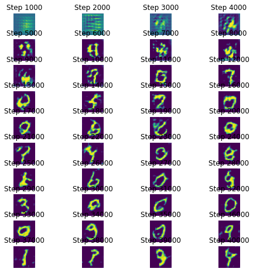
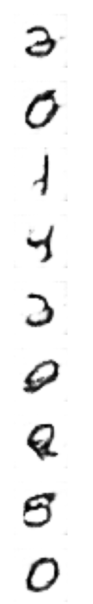

# dcgan
> DCGAN ( Deep Convolutional Generative Adversarial Networks ) by Alec Radford et al. <a href='https://arxiv.org/abs/1406.2661'>paper](https://arxiv.org/abs/1511.06434) provides an improvement over the original GAN [paper</a> by Ian Goodfellow et al.


This file will become your README and also the index of your documentation.

## Install

`pip install git+https://github.com/numb3r33/dcgan.git`

## How to use

Fill me in please! Don't forget code examples:

```
#ignore
path = untar_data(URLs.MNIST)
dls  = get_dls(path, bs=128)
```

```
#ignore
dc_gan = DCGAN(ch_in=1,
               z_dim=64
               )

learn = dcgan_learner(dls, dc_gan, opt_func=partial(Adam, betas=(0.5, 0.999)))
```

```
#ignore
learn.fit(n_epoch=75, lr=2e-4)
```

**How generator learns during various epochs of training.** One can see the quality of images improving over time.



```
#ignore
learn.show_results(ds_idx=0)
```

**Result after training for 75 epochs**


